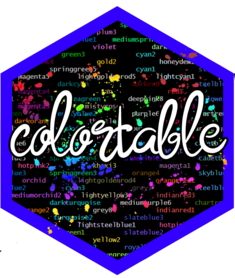
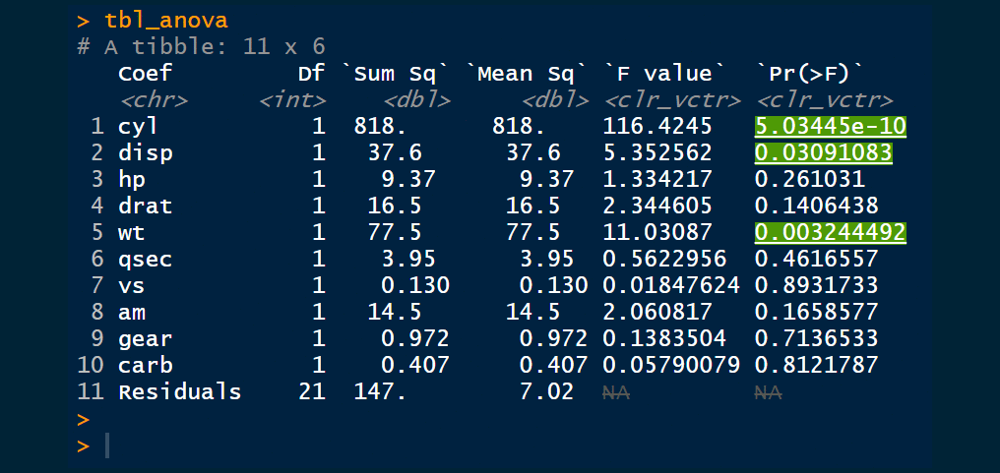
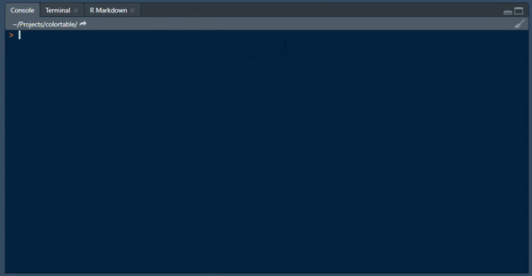

<!-- README.md is generated from README.Rmd. Please edit that file -->

```{r, include = FALSE}
knitr::opts_chunk$set(
  collapse = TRUE,
  comment = "#>",
  fig.path = "man/figures/README-",
  out.width = "100%"
)
```

# colortable 

<!-- badges: start -->
[](https://www.tidyverse.org/lifecycle/#experimental)
[](https://github.com/thebioengineer/colortable/actions)
[](https://travis-ci.org/thebioengineer/colortable)
[](https://codecov.io/gh/thebioengineer/colortable?branch=master)
<!-- badges: end -->

The goal of colortable is to make it easier to color and style your tables.

Current styling technologies such as kableExtra and formattable make you go to your final printing status before you can see the coloring and styling applied.
This adds overhead and iterating on outputs and sometimes require compiling entire reports to check minute changes. Alternatively, one can hard-code the styling into the table, but this then requires complete changes to data types in the tables. 

{{colortable}} solves this conundrum by allowing the user to keep the types of the contents, and applies the style updates on printing.

## Installation

<!-- You can install the released version of colortable from [CRAN](https://CRAN.R-project.org) with: -->

Currently {{colortable}} is only available on github, and is very much under development.

``` r
remotes::install_github("thebioengineer/colortable")
## install.packages("colortable") ## Not Available on CRAN
```

## Example

A common case I have seen for coloring values is from analysis coloring p-values.
Normally, when I have seen this the color is hard-coded in an ifelse statement with a paste0. 
However, this liits the output to a single type. 

The benefit of {{colortable}} is that the same code can be used across outputs and even in the console!


```{r example, eval = FALSE}
  library(tidyverse)
  library(colortable)
  library(knitr)

## Super Great analysis of mtcars!

lm_fit <- lm(mpg ~ ., mtcars)

a_lm_fit <- anova(lm_fit)

tbl_anova <- a_lm_fit %>% 
  as_tibble()%>% 
  mutate(
    Coef     = rownames(a_lm_fit),
    `Pr(>F)` = set_styling(`Pr(>F)`, `Pr(>F)` < 0.05, background = "green", style = "underline"),
    `Pr(>F)` = set_styling(`Pr(>F)`, is.na(`Pr(>F)`), style = "strikethrough", text_color = "silver"),
    `F value` = set_styling(`F value`, is.na(`F value`), style = "strikethrough", text_color = "silver")
  ) %>% 
  select(Coef, everything())

kable(tbl_anova, escape = FALSE)

```



## Output types

In order to simply generate a color_vctr, which is the lowest object type, use the `color_vctr` function. 
It can convert any atomic (numeric, integer, complex, character, logical, raw) into a color_vctr where text and background colors, and styles can be set.

To see the available styles and colors, use the `valid_*` family of functions: `valid_text_color()`, `valid_background()`, and `valid_style()`.
To check whether the styling is a valid type for the output, set the method to be "latex" for pdf outputs, or "html" for html outputs.

Below is a random sampling of output types to the console:

```{r, eval = FALSE}

data.frame(
  text_color = sample(c(NA, valid_text_color()),10, replace = TRUE),
  background = sample(c(NA, valid_background()),10, replace = TRUE),
  style      = sample(c(NA, valid_style()),10, replace = TRUE),
  stringsAsFactors = FALSE
  ) %>% 
  mutate(
    background = ifelse(text_color == background, 
                  sample(c(NA, valid_background()),10, replace = TRUE),
                  background)
  ) %>% 
  mutate(
  example = color_vctr(runif(10),
                       text_color = text_color,
                       background = background,
                       style = style)
  )

```





## The Nuts and Bolts

{{colortable}} works by making a special S3 class called a `colortable_vect`, and custom print/format functions.
Currently it only works with tibbles, but there are plans to make it friendly with data.frames.


## Inspiration
This idea was inspired by [`crayon`](https://github.com/r-lib/crayon), and has some elements based on it. I thank all the developers of that project!


## COC

Please note that the 'colortable' project is released with a
[Contributor Code of Conduct](CODE_OF_CONDUCT.md).
By contributing to this project, you agree to abide by its terms.

