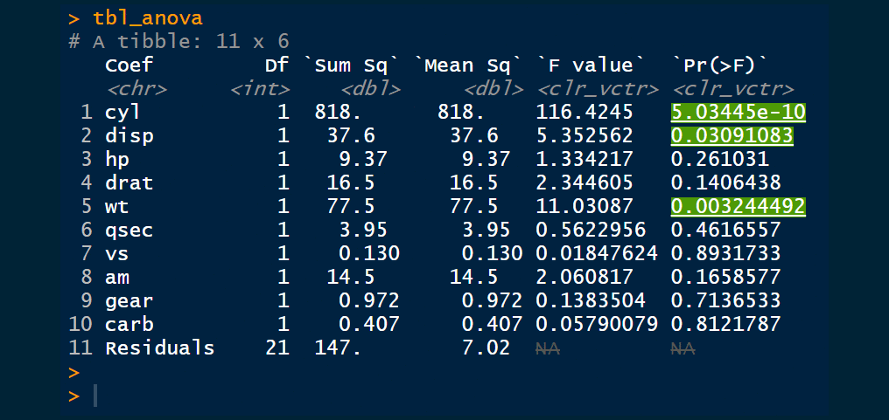

<!-- README.md is generated from README.Rmd. Please edit that file -->

# colortable 

<!-- badges: start -->

[](https://www.tidyverse.org/lifecycle/#experimental)
[](https://github.com/thebioengineer/colortable/actions)
[](https://codecov.io/gh/thebioengineer/colortable?branch=master)
<!-- badges: end -->

Seamlessly style and print your vectors across Rmarkdown output types
through a single interface. colortable enables users to style and color
the contents of their vectors, data.frames, and tibbles through the
object, and function, `color_vctr()`.

At this point, the supported output types include:

<div style="display:inline-block">


</div>

## Installation

<!-- You can install the released version of colortable from [CRAN](https://CRAN.R-project.org) with: -->

Currently {colortable} is only available on github, and is very much
under development.

``` r
remotes::install_github("thebioengineer/colortable")
## install.packages("colortable") ## Not Available on CRAN
```

## Getting Started

{colortable} works by making a special S3 class called a `color_vctr`,
and custom print/format functions.

It then has 4 arguments; - The vector to be styled - text\_color, a
vector that is either the color the entire vector to be colored or each
element - style, a vector is either the style the enture vector to be
styled with or each element - background, a vector that is either the
background color the entire vector to be colored or for each element.

Additionally, there is a few helper functions - `set_styling()` uses a
boolean argument to apply the styling - `color_scale()` is to be used
for setting colors, accepting a pallette

*A note, html styling does not apply in a github readme*

``` r
library(colortable)
#> Registered S3 methods overwritten by 'colortable':
#>   method                from     
#>   knit_print.data.frame rmarkdown
#>   print.data.frame      base

color_vctr(c(1,2,3,4),
           text_color = c("blue","green", "yellow",NA),
           style = c("underline","italic",NA,"bold"),
           background = c(NA,NA,"blue",NA))
```

<pre><code class = "hljs"><span>## [1] <span style='text-decoration:underline;color:blue;'>1</span> <span style='font-style:italic;color:lime;'>2</span> <span style='color:yellow;background:blue;'>3</span> <span style='font-weight:bold;'>4</span> </span><br></code></pre>

``` r

color_vctr(LETTERS, text_color = color_scale(colorRamp(c("red","yellow"))))
```

<pre><code class = "hljs"><span>## [1] <span style='color:#FF0000;'>A</span> <span style='color:#FF0A00;'>B</span> <span style='color:#FF1400;'>C</span> <span style='color:#FF1F00;'>D</span> <span style='color:#FF2900;'>E</span> <span style='color:#FF3300;'>F</span> <span style='color:#FF3D00;'>G</span> <span style='color:#FF4700;'>H</span> <span style='color:#FF5200;'>I</span> <span style='color:#FF5C00;'>J</span> <span style='color:#FF6600;'>K</span> <span style='color:#FF7000;'>L</span> <span style='color:#FF7A00;'>M</span> <span style='color:#FF8500;'>N</span> <span style='color:#FF8F00;'>O</span> <span style='color:#FF9900;'>P</span> <span style='color:#FFA300;'>Q</span> <span style='color:#FFAD00;'>R</span> <span style='color:#FFB800;'>S</span> <span style='color:#FFC200;'>T</span> <span style='color:#FFCC00;'>U</span> <span style='color:#FFD600;'>V</span> <span style='color:#FFE000;'>W</span> <span style='color:#FFEB00;'>X</span> <span style='color:#FFF500;'>Y</span> <span style='color:#FFFF00;'>Z</span> </span><br></code></pre>

``` r
color_vctr(LETTERS, text_color = color_scale("Blues"))
```

<pre><code class = "hljs"><span>## [1] <span style='color:#F7FBFF;'>A</span> <span style='color:#EFF6FC;'>B</span> <span style='color:#E7F1FA;'>C</span> <span style='color:#DFECF7;'>D</span> <span style='color:#D7E6F5;'>E</span> <span style='color:#D0E1F2;'>F</span> <span style='color:#C8DCF0;'>G</span> <span style='color:#BDD7EC;'>H</span> <span style='color:#B0D1E7;'>I</span> <span style='color:#A3CCE3;'>J</span> <span style='color:#94C4DF;'>K</span> <span style='color:#85BBDB;'>L</span> <span style='color:#74B2D8;'>M</span> <span style='color:#65A9D3;'>N</span> <span style='color:#59A0CE;'>O</span> <span style='color:#4B98C9;'>P</span> <span style='color:#3F8EC4;'>Q</span> <span style='color:#3583BF;'>R</span> <span style='color:#2B79B9;'>S</span> <span style='color:#206EB3;'>T</span> <span style='color:#1964AB;'>U</span> <span style='color:#115AA3;'>V</span> <span style='color:#08509A;'>W</span> <span style='color:#09458A;'>X</span> <span style='color:#093A7A;'>Y</span> <span style='color:#08306B;'>Z</span> </span><br></code></pre>

## Example

A common case I have seen for coloring values is from analysis coloring
p-values. Normally, when I have seen this the color is hard-coded in an
ifelse statement with a paste0. However, this liits the output to a
single type.

The benefit of {{colortable}} is that the same code can be used across
outputs and even in the console\!

``` r
library(tidyverse)
library(knitr)

## Super Great analysis of mtcars!

lm_fit <- lm(mpg ~ ., mtcars)

a_lm_fit <- anova(lm_fit)

tbl_anova <- a_lm_fit %>% 
  as_tibble()%>% 
  mutate(
    Coef     = rownames(a_lm_fit),
    `Pr(>F)` = set_styling(`Pr(>F)`, `Pr(>F)` < 0.05, background = "green", style = "underline"),
    `Pr(>F)` = set_styling(`Pr(>F)`, is.na(`Pr(>F)`), style = "strikethrough", text_color = "silver"),
    `F value` = set_styling(`F value`, is.na(`F value`), style = "strikethrough", text_color = "silver")
  ) %>% 
  select(Coef, everything())

kable(tbl_anova, escape = FALSE)
```



## Output types

In order to simply generate a color\_vctr, use the `color_vctr`
function. It can convert any atomic (numeric, integer, complex,
character, logical, raw) into a color\_vctr where text and background
colors, and styles can be set.

To see the available styles and colors, use the `valid_*` family of
functions: `valid_colors()`or `valid_style()`. To check whether the
styling is a valid type for the output, set the method to be “latex” for
pdf outputs, or “html” for html outputs.

Below is a random sampling of output types to the console:

``` r

data.frame(
  text_color = sample(c(NA, valid_text_color()),10, replace = TRUE),
  background = sample(c(NA, valid_background()),10, replace = TRUE),
  style      = sample(c(NA, valid_style()),10, replace = TRUE),
  stringsAsFactors = FALSE
  ) %>% 
  mutate(
    background = ifelse(text_color == background, 
                  sample(c(NA, valid_background()),10, replace = TRUE),
                  background)
  ) %>% 
  mutate(
  example = color_vctr(runif(10),
                       text_color = text_color,
                       background = background,
                       style = style)
  )
```


## Inspiration

This idea was inspired by [`crayon`](https://github.com/r-lib/crayon),
and has some elements based on it. I thank all the developers of that
project\! Since then, I have been insprired by
[‘flextable’](https://github.com/davidgohel/officedown) for word
development.

Current styling technologies such as {kableExtra} and {formattable} also
inspired the development of this project.

## COC

Please note that the ‘colortable’ project is released with a
[Contributor Code of Conduct](CODE_OF_CONDUCT.md). By contributing to
this project, you agree to abide by its terms.
