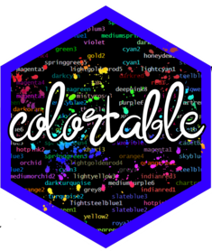

<center>

</center>
## Color Scales

```{r color_vctrs, results = 'asis', messages = FALSE, warning = FALSE, echo = FALSE}
suppressMessages({
  library(tidyverse)
  library(colortable)
  library(knitr)
  library(kableExtra)
})

color_vctr(1:10, text_color = color_scale("Blues"))
cat("<br>")
color_vctr(1:20, text_color = color_scale(palette = colorRamp(c("blue", "yellow", "red"))))

```

## Valid HTML Styles

```{r pdf-styles, echo = FALSE}

possible_styles <- valid_style(method = "html")

data.frame(Styles = possible_styles,
           Example = color_vctr(rep("Lorem Ipsum",length(possible_styles)), style = possible_styles)) %>%
  data.frame() %>% 
  format() %>% 
  kable(escape = FALSE) %>% 
  kable_styling(bootstrap_options = c("striped", "hover", "condensed"),full_width = F)

```

## Valid HTML Colors

```{r messages = FALSE, warning = FALSE, echo = FALSE}

possible_colors <- valid_colors(method = "html")

possible_colors %>%
  mutate(
    `Color` =
      color_vctr(
        possible_colors$`Color Name`,
        text_color = possible_colors$`Color Name`),
    `Hex Code` =
      color_vctr(possible_colors$`Hex Code`,
                 background = possible_colors$`Hex Code`)
  ) %>%
  select(`Color Name`, Color, `Hex Code`) %>% 
  data.frame() %>% 
  format() %>% 
  knitr::kable(escape = FALSE) %>% 
  kable_styling(bootstrap_options = c("striped", "hover", "condensed"),full_width = F)
  

```

